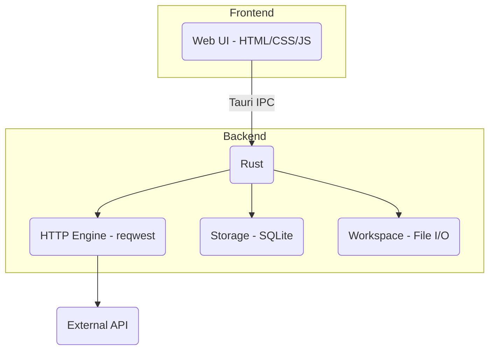

# PRISM

**A modern, local-first API testing tool built with Rust and Tauri.**

Prism is a lightweight and fast desktop application for all your API testing needs. It's a developer-focused alternative to tools like Postman and Insomnia, designed to be simple, efficient, and completely offline.

---

### Built with


---

## The Problem

Modern API clients are often bloated, slow, and heavily reliant on the cloud. They require you to create accounts, store your data on their servers, and deal with unnecessary complexity for what should be a simple task: testing your APIs. This can be a privacy concern and a drag on your development workflow.

## Our Solution

Prism is a **local-first** API testing tool that puts you in control.

*   **No Cloud, No Accounts:** Everything is stored locally on your machine. Your data is your own.
*   **Fast and Lightweight:** Built with Rust and Tauri, Prism is significantly smaller and faster than Electron-based alternatives.
*   **Git-Friendly:** Save your API requests as simple JSON files. Version control your requests alongside your code.
*   **Simple and Focused:** Prism provides the essential features for API testing without the bloat.

---

## Features

| Feature                  | Description                                                                                              |
| ------------------------ | -------------------------------------------------------------------------------------------------------- |
| **All HTTP Methods**     | `GET`, `POST`, `PUT`, `DELETE`, `PATCH`.                                                                 |
| **Full Request Control** | Customize URL, parameters, headers, and body.                                                            |
| **Multiple Auth Types**  | `Bearer Token`, `API Key`, and `Basic Auth` are supported.                                               |
| **Response Viewer**      | View response status, time, size, headers, and a pretty-printed JSON body.                               |
| **Request History**      | All your requests are saved locally in a SQLite database for easy access.                                |
| **Environment Variables**| Use `{{VARIABLE}}` syntax in your requests for dynamic values.                                           |
| **File-Based Requests**  | Save and load your requests as portable JSON files.                                                      |
| **cURL Export**          | Instantly generate a cURL command for any request.                                                       |
| **Dark Mode**            | A beautiful dark mode UI for those late-night coding sessions.                                           |
| **Keyboard Shortcuts**   | `Ctrl+Enter` to send, `Ctrl+S` to save, `Ctrl+O` to open.                                                |

---

## Why Local-First?

### Privacy
- No account required
- No data sent to cloud
- No telemetry or tracking
- Your API keys stay on your machine

### Portability
- Request files are plain JSON
- Commit to Git with your code
- Share via any method (Git, email, Slack)
- No vendor lock-in

### Performance
- Native Rust HTTP engine
- No network overhead for UI
- Instant startup
- Low memory footprint (~50MB)

### Simplicity
- No sync conflicts
- No subscription
- No internet required (except for requests)
- Works offline

---

## Future Scope

Potential additions (not committed):
- Collections/folders UI
- Request chaining
- GraphQL support
- WebSocket testing
- Response history
- Import from Postman/Insomnia

---

## Architecture

Prism is built with a simple and powerful architecture that separates the frontend UI from the backend logic.



---

## Documentation

| Document                  | Description                                                                                              |
| ------------------------- | -------------------------------------------------------------------------------------------------------- |
| [ARCHITECTURE.md](docs/ARCHITECTURE.md) | Explains the technical architecture, data flow, and technology stack of the application.                  |
| [BUILD.md](docs/BUILD.md)         | A complete guide to building Prism from source, including prerequisites and platform-specific instructions. |
| [CHANGELOG.md](docs/CHANGELOG.md)     | A log of all notable changes made to Prism, organized by version.                                        |
| [ENV_VARIABLES_GUIDE.md](docs/ENV_VARIABLES_GUIDE.md) | A guide on how to use environment variables for dynamic API testing.                                     |
| [FILE_SAVE_LOAD_GUIDE.md](docs/FILE_SAVE_LOAD_GUIDE.md) | Explains how to save and load API requests as JSON files.                                                |
| [QUICKSTART.md](docs/QUICKSTART.md)     | A quick start guide to get the application running.                                                      |
| [RUN.md](docs/RUN.md)           | Detailed instructions on how to run the Prism application.                                               |
| [SETUP_INSTRUCTIONS.md](docs/SETUP_INSTRUCTIONS.md) | Step-by-step instructions for setting up the development environment.                                    |

---

## Quick Start

### Prerequisites

*   **Rust** (1.77.2+): [Install Rust](https://rustup.rs/)
*   **System dependencies** (Linux only):
    ```bash
    # Ubuntu/Debian
    sudo apt install libwebkit2gtk-4.1-dev libssl-dev libgtk-3-dev libayatana-appindicator3-dev librsvg2-dev
    ```

### Run Locally

1.  **Clone the repository:**
    ```bash
    git clone https://github.com/dev-Ninjaa/prism.git
    cd prism
    ```
2.  **Run in development mode:**
    ```bash
    cd src-tauri
    cargo tauri dev
    ```

The app will launch in about 10 seconds on the first run due to Rust compilation.

### Build for Production

```bash
cd src-tauri
cargo tauri build
```

The compiled application will be in the `src-tauri/target/release` directory.

---

## Contributing

This is a personal project, but feel free to fork it and make it your own!

```bash
git clone https://github.com/dev-Ninjaa/prism.git
cd prism
# Start coding!
```

---

## License

This project is licensed under the MIT License. See the [LICENSE](LICENSE) file for details.
